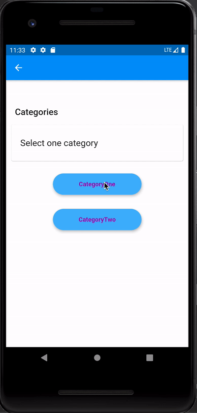

# Flow Form

This is Flow Form library help to design a flow of form using a JSON file in given [Format](#json-format).


### How it looks




### How it works

The file will have a flow which will be converted internally into a tree structure with given branching in the file and will maintain and update the states of the form using the redux internally. Currently, it's an acyclic tree.


## Getting Started

First, we need to create a JSON file representing our form flow using the given [format](#json-format) and then provide that path to the library.

It consists of three component FlowForm to get started.

1. Builder
2. Provider
3. Notifier

### 1. Build the Form

We need to build our form by setting the required JSON flow file path and other optional properties.

```dart
final flowFormBuilder = FlowFormBuilder('assets/json/flow.json')
    ..screenMetaPath = 'assets/json/screen_data.json'
    ..database = DatabaseImpl()
    ..registerWidget = (String type) {
      switch (type) {
        case SelectScreen.type:
          return SelectScreen();
        case DatePickerScreen.type:
          return DatePickerScreen();
        case TextInputScreen.type:
          return TextInputScreen();
        case FileUploadScreen.type:
          return FileUploadScreen();
        default:
          return const Center(
            child: Text('Form Ends Here'),
          );
      }
    };
final FlowForm = flowFormBuilder.build();
```


### 2. FlowFormProvider

We need to pass the `FlowForm` which we got from above builder to `FlowFormProvider` widget.

```dart
FlowFormProvider(
  flowForm: flowForm,
  child: MaterialApp(
    // Top Parent Widget
  ),
)
```

This best practice is to wrap this FlowFormProvider to the topmost parent widget.

### 3. FlowFormNotifier

To get the update to to display a form, we need to wrap the widget into `FlowFormNotifier` which requires a widget in return we want to build on the basic of current `formMetadata` .

```dart
@override
Widget build(BuildContext context) {
  var formProvider = FlowFormProvider.of(context);
  return FlowFormNotifier(builder: (formMetadata) {
    if (formMetadata != null) {
      return formProvider.getWidget(formMetadata.screenType);
    }
    return Container();
  });
}
```

We can use `formProvider.getWidget(type)` to get widget we registered in the `FlowFormBuilder`.


## Setup Custom Database

We can also add our database implementation by implementing the `Database` class and setting up in the app like this.

```dart
my_database_impl.dart

class MyDatabaseImpl implements Database {
  ///Function to save data
  void saveData({StoreViewModel viewModel, dynamic answer}) {
    // my save implementation
  }

  ///Example Function to upload image to fireBase
  void uploadImage() {
  }

  String getData(String dataKey) {
   // key to fetch screen data and save user input in db.
    var box = Hive.box('DataBox');
    String data = box.get(dataKey);
    DataStorage.updateData(dataKey, data);
    return data;
  }
}
```


## JSON Format

This is how ths json should be formatted.

```json
{
  "questionIds": [
    "question_id_1",
    "question_id_2",
    "question_id_3"
  ],
  "nextQuestion": {
    "answerBranch": {
      "yes": {
        "questionIds": [
          "question_id_4",
          "question_id_5"
        ],
        "nextQuestion": {
          "answerBranch": {
            "private": {
              "questionIds": [
                "end"
              ],
              "nextQuestion": {
                "answerBranch": {}
              }
            },
            "public": {
              "questionIds": [
                "end"
              ],
              "nextQuestion": {
                "answerBranch": {}
              }
            }
          }
        }
      },
      "no": {
        "questionIds": [
          "question_id_6",
          "ends"
        ],
        "nextQuestion": {
          "answerBranch": {}
        }
      }
    }
  }
}
```

**Note :**
1. Where `questionIds` are the list of ids which we used to fetch screen data of the specific question.
2. The `answerBranch` the branching part where we navigate to different flow based on the selected answer.
3. Keep the all json keys in camel case to keep the consistency.


Made with ❤️ from  [Technogise](https://technogise.com/)

## BSD 3-Clause License

Copyright (c) 2020, Technogise Private Limited
All rights reserved.

Redistribution and use in source and binary forms, with or without
modification, are permitted provided that the following conditions are met:

1. Redistributions of source code must retain the above copyright notice, this
   list of conditions and the following disclaimer.

2. Redistributions in binary form must reproduce the above copyright notice,
   this list of conditions and the following disclaimer in the documentation
   and/or other materials provided with the distribution.

3. Neither the name of the copyright holder nor the names of its
   contributors may be used to endorse or promote products derived from
   this software without specific prior written permission.

THIS SOFTWARE IS PROVIDED BY THE COPYRIGHT HOLDERS AND CONTRIBUTORS "AS IS"
AND ANY EXPRESS OR IMPLIED WARRANTIES, INCLUDING, BUT NOT LIMITED TO, THE
IMPLIED WARRANTIES OF MERCHANTABILITY AND FITNESS FOR A PARTICULAR PURPOSE ARE
DISCLAIMED. IN NO EVENT SHALL THE COPYRIGHT HOLDER OR CONTRIBUTORS BE LIABLE
FOR ANY DIRECT, INDIRECT, INCIDENTAL, SPECIAL, EXEMPLARY, OR CONSEQUENTIAL
DAMAGES (INCLUDING, BUT NOT LIMITED TO, PROCUREMENT OF SUBSTITUTE GOODS OR
SERVICES; LOSS OF USE, DATA, OR PROFITS; OR BUSINESS INTERRUPTION) HOWEVER
CAUSED AND ON ANY THEORY OF LIABILITY, WHETHER IN CONTRACT, STRICT LIABILITY,
OR TORT (INCLUDING NEGLIGENCE OR OTHERWISE) ARISING IN ANY WAY OUT OF THE USE
OF THIS SOFTWARE, EVEN IF ADVISED OF THE POSSIBILITY OF SUCH DAMAGE.